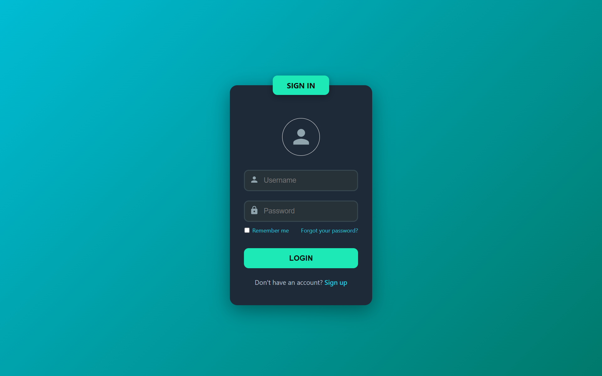
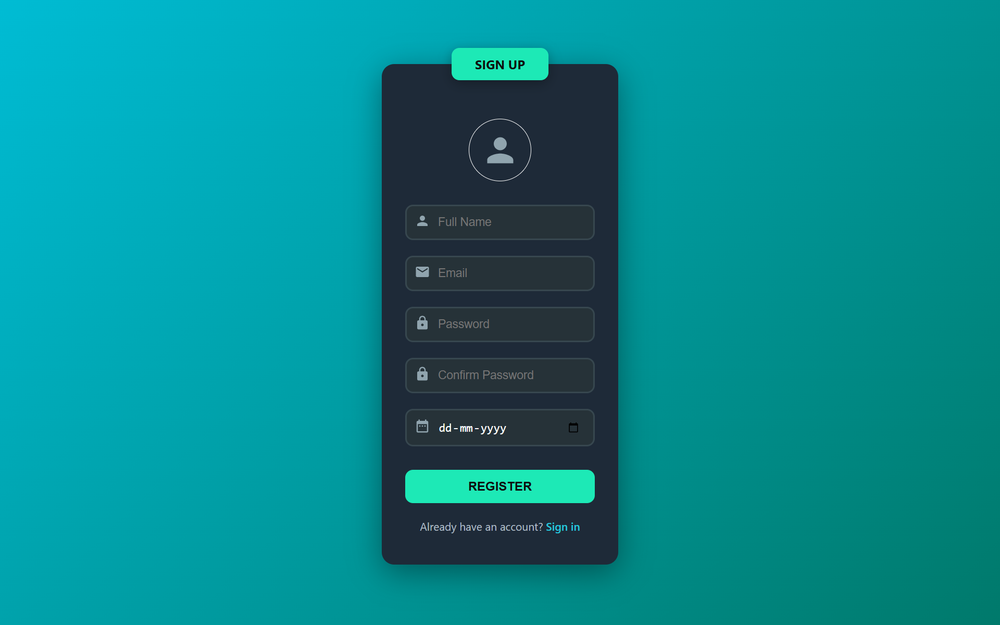
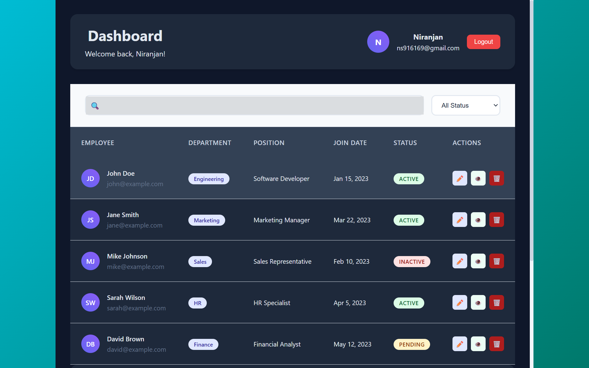

# 🔐 Authentication System

A complete **Authentication System** built with **React.js** (Frontend) and **Node.js + Express** (Backend), featuring secure user registration, login, JWT-based authentication, and a responsive dashboard.


## 📸 Screenshots

| Login Page | Register Page | Dashboard |
|------------|---------------|-----------|
|  |  |  |


## 🚀 Features

- ✅ User Registration & Login
- 🔐 JWT Authentication
- 🖥️ Protected Dashboard
- 🎨 Responsive & Modern UI
- 📊 Data Table with Search & Filter
- 🔒 Password Hashing (bcryptjs)
- 🌐 MongoDB (Local or Atlas)

---

## 🛠️ Tech Stack

### 🔧 Backend
- Node.js
- Express.js
- MongoDB + Mongoose
- JWT (JSON Web Tokens)
- bcryptjs
- express-validator

### 💻 Frontend
- React.js
- React Router DOM
- Axios
- CSS (Flexbox & Grid)

---

## ⚙️ Installation & Setup

### 📦 Prerequisites

- Node.js (v14+)
- MongoDB (Local or MongoDB Atlas)

### 🔙 Backend Setup

```bash
cd backend
npm install
```

Create a `.env` file:

```env
MONGODB_URI=mongodb://localhost:27017/authdb
JWT_SECRET=your_super_secret_jwt_key
PORT=5000
```

Start the backend:

```bash
npm start
```

📍 Backend runs at: `http://localhost:5000`

---

### 🔜 Frontend Setup

```bash
cd frontend
npm install
```

Create a `.env` file:

```env
REACT_APP_API_URL=http://localhost:5000/api
```

Start the frontend:

```bash
npm start
```

📍 Frontend runs at: `http://localhost:3000`

---

## 📡 API Endpoints

| Method | Endpoint             | Description         |
|--------|----------------------|---------------------|
| POST   | /api/auth/register   | Register new user   |
| POST   | /api/auth/login      | Login existing user |
| GET    | /api/auth/me         | Get current user    |

#### Register Example
```json
{
  "name": "John Doe",
  "email": "john@example.com",
  "password": "password123",
  "dateOfBirth": "1990-01-01"
}
```

#### Login Example
```json
{
  "email": "john@example.com",
  "password": "password123"
}
```

---

## 🧠 Database Schema

### User Model

```javascript
{
  name: String,
  email: String,
  password: String, 
  dateOfBirth: Date,
  createdAt: Date,
  updatedAt: Date
}
```

---

## 🛡️ Security Features

- JWT Authentication
- bcryptjs for password hashing
- Input Validation (express-validator)
- Environment-based Configuration
- CORS Configuration
- Protected Routes

---

## 📁 Project Structure

```
auth-system/
├── backend/
│   ├── config/
│   ├── middleware/
│   ├── models/
│   ├── routes/
│   ├── server.js
│   └── .env
│
├── frontend/
│   ├── public/
│   ├── src/
│   │   ├── components/
│   │   ├── services/
│   │   ├── App.js
│   │   └── index.js
│   └── .env
│
├── screenshots/
│   ├── login.png
│   ├── register.png
│   └── dashboard.png
└── README.md
```

---

## 🧪 Usage Steps

1. Start both backend and frontend servers
2. Open `http://localhost:3000`
3. Register or login
4. Access dashboard upon authentication
5. View user data & sample employee table
6. Use the logout button to sign out

---

## 🌍 Environment Variables

### Backend `.env`

```env
MONGODB_URI=mongodb://localhost:27017/authdb
JWT_SECRET=your_jwt_secret_key
PORT=5000
```

### Frontend `.env`

```env
REACT_APP_API_URL=http://localhost:5000/api
```

---

## 🙌 Contributing

1. Fork the repository
2. Create your feature branch:
   ```bash
   git checkout -b feature/your-feature
   ```
3. Commit your changes:
   ```bash
   git commit -m "Add feature"
   ```
4. Push to the branch:
   ```bash
   git push origin feature/your-feature
   ```
5. Open a Pull Request


> Developed with ❤️ by **Niranjan**
